<h1 align="center">Dot Art</h1>

  

# 도트를 찍어보자

### 캔버스가 아닌 Div와 CSS를 이용해 도트를 찍는 앱입니다!

CSS의 box-shadow를 이용해 도트 그림을 표현할 수 있습니다.
또한 여러 프레임을 CSS animation과 keyframes를 이용하여 하나의 애니메이션으로 만들 수 있죠.

귀여운 젤리가 그려진 데모 사이트 [직접 해보러 가기](https://ahnkwang7379.github.io/dotArt/) :pencil2:

 
  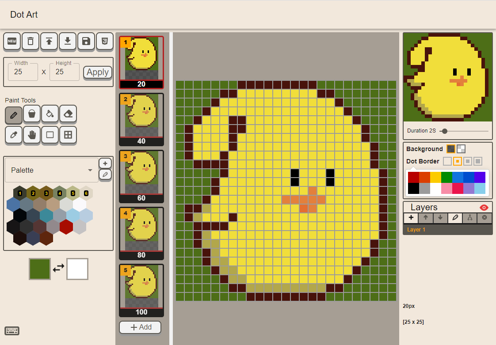 

 

# 간단한 사용법

## Paint Tools

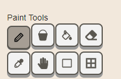

연필, 색 채우기, 지우개 등 기본적인 툴이 제공되며, 툴 마다 단축키가 지정되어 있습니다.

move 툴은 일반 이동과 wrap모드 이동이 가능합니다.

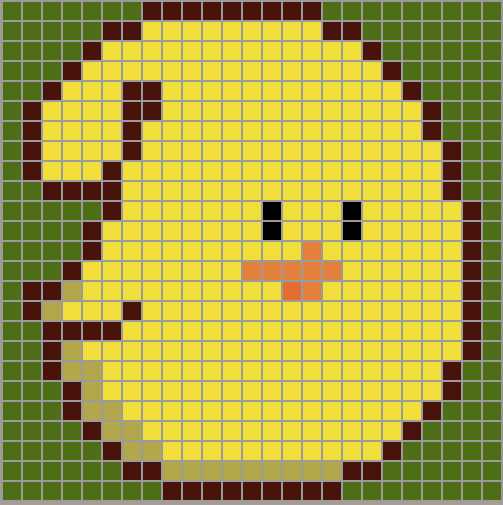

---

## Layer

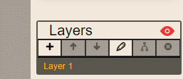

layer 생성 / 복사 / 삭제 / 합치기 기능과 layer 별 순서 변경, 이름 변경이 가능합니다.

merge시 선택한 layer와 그 아래 layer를 합치게 되며, 선택한 layer를 우선으로 하여 합치게 됩니다.

---

## Palette

  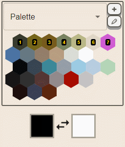
  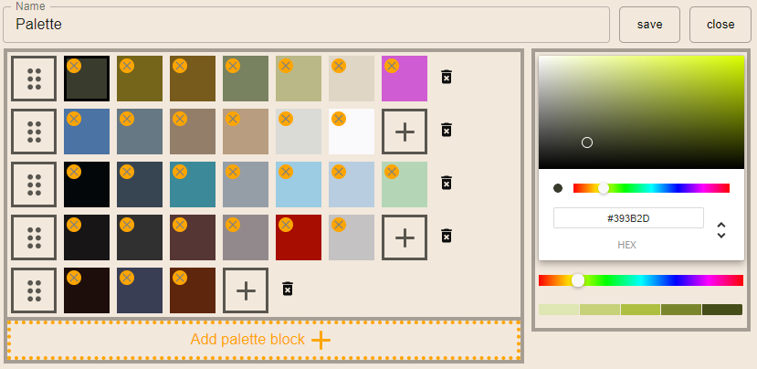

한 라인에 최대 7개까지 색이 지정 가능하며 키보드 위 아래 방향키를 이용해 라인을 이동할 수 있습니다.

키보드 위쪽 숫자 키패드 1 ~ 7까지 단축키가 지정되어 각 라인별 색상을 바로바로 사용 가능합니다.

localStorage를 이용하여 사용자 정의 팔레트를 만들고 저장할 수 있습니다.

---

## Minimap

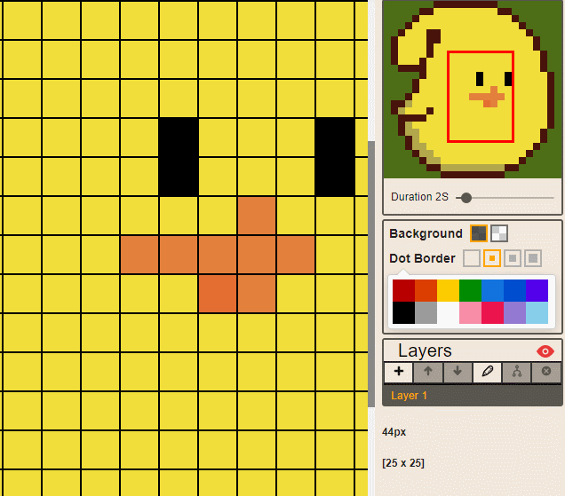

빨간 네모박스는 실제로 보고있는 화면의 범위를 나타내줍니다.

네모박스를 드래그하면 그에 맞춰 화면을 조절해 원하는 곳으로 편하게 이동할 수 있게 해줍니다.

그 외에 애니메이션 시간을 조절할 수 있습니다. (FPS가 아니라 조금 어색할 수 있지만 CSS의 animation은 총 애니메이션 시간인 duration으로 표현되기 때문에 몇 초 내에 전체 프레임을 다 보여주는 지 표시했습니다)

frame list의 하단 숫자를 바꾸는 것으로 각 frame이 애니메이션에서 차지하는 비율을 따로 지정할 수 있습니다.

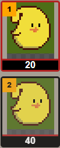

위의 이미지에서 20은 2초의 애니메이션의 20%인 0.4초동안 유지됨을 의미합니다.

---

## etc

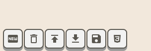

localStorage에 세이브 / 로드가 가능합니다.

### 완성된 작업물 다운로드

  
  
  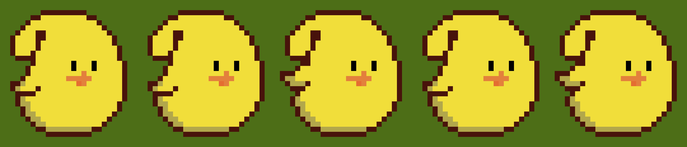

작업물을 png, gif형식으로 다운로드 가능하며 sprite 형식으로도 가능합니다.

### 웹 상에서 코드로 사용하기

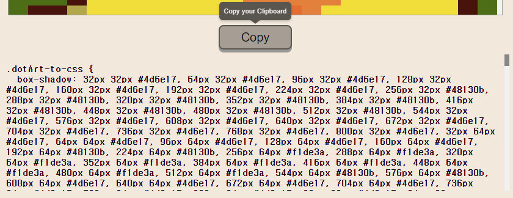

웹에서 사용 가능한 CSS 코드도 지원합니다. 복사 후 html 요소에 class 이름으로 .dotArt-to-css를 붙여주면 됩니다.

### JSON file 다운로드
[예시 보러가기](https://github.com/ahnkwang7379/dotArt/blob/master/frontend/screenshots/jellyppi.dotart)

자신의 dotArt를 JSON 형식으로 다운로드 받을 수 있으며 (.dotart 파일로 다운로드 됩니다) 다른 곳에서 import해 작업을 이어나갈 수 있습니다.

# 기술 스택

- [react](https://facebook.github.io/react/) : 인터페이스 구현을 위한 react
- [react-hooks](https://ko.reactjs.org/docs/hooks-reference.html) : 함수형으로 설계되었습니다.
- [redux](http://redux.js.org/) : 넓은 범위에서 쓰이는 state를 편하게 관리하기 위해 적용
- [redux-actions](https://redux-actions.js.org/) : redux의 action을 더 간단하게 만들었습니다.
- [style-components](https://styled-components.com/) : CSS IN JS 라이브러리
- [immer](https://immerjs.github.io/immer/docs/introduction) : 불변성 + 코드 가독성을 위해 적용
